# Тестування працездатності системи

## Тестування REST API

### GET

#### GET /media/{id}

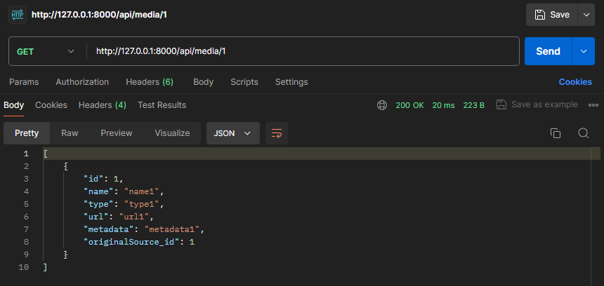

#### GET /role/{id}

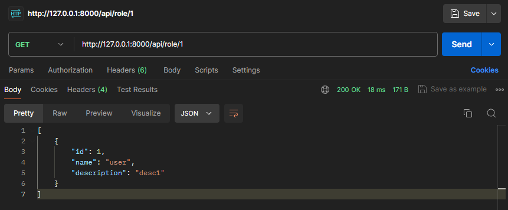

### POST

#### GET /allroles

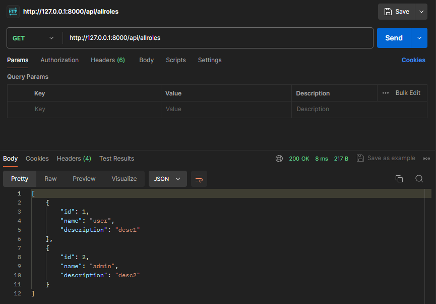

#### POST /addrole

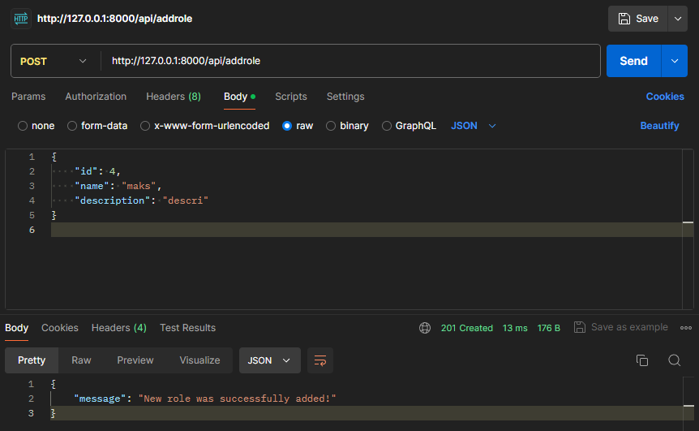

#### GET /allroles

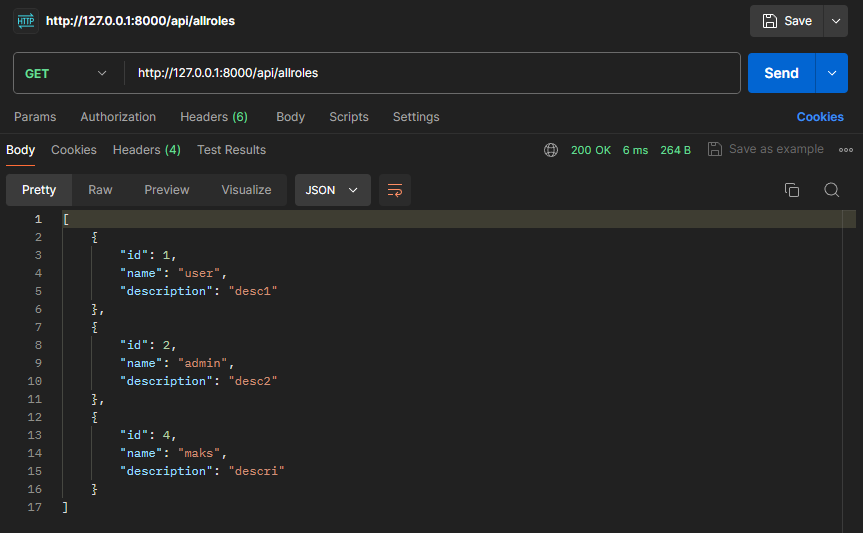

### PUT

#### GET /media/{id}

#### PUT /updatemedia/{id}

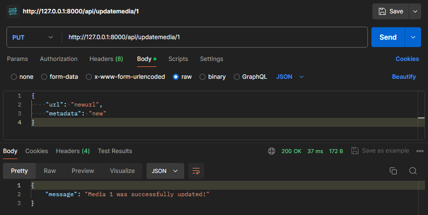

#### GET /media/{id}

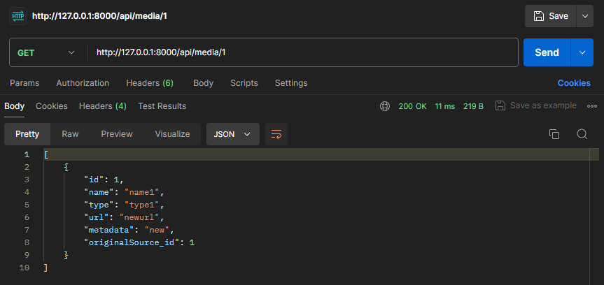

#### GET /role/{id}

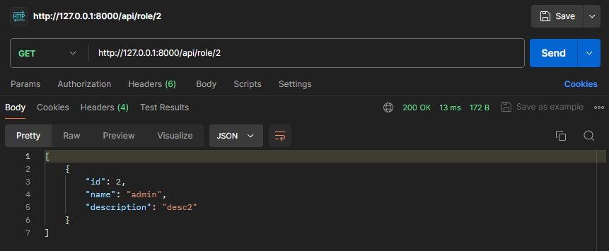

#### PUT /updaterole/{id}

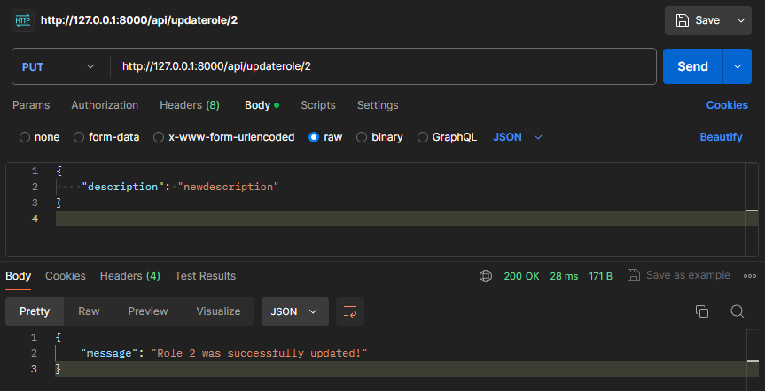

#### GET /role/{id}

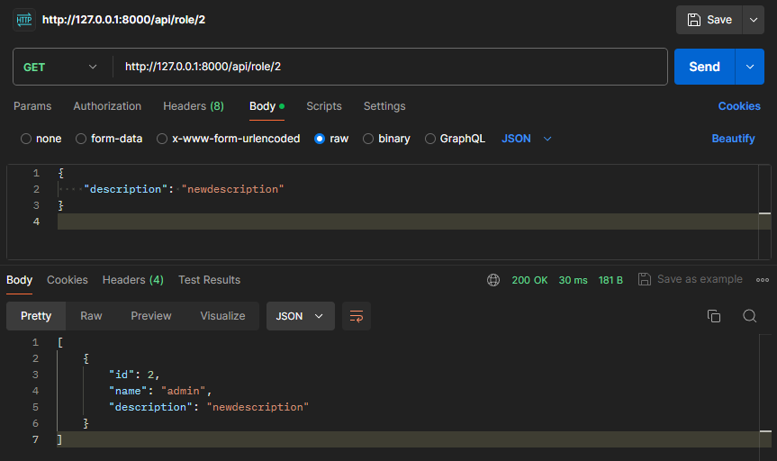

### DELETE

#### GET /allmedia

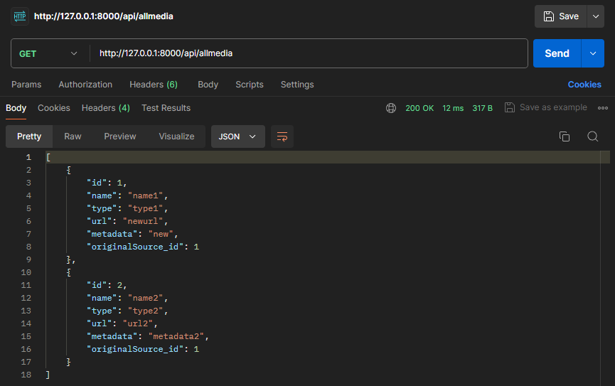

#### DELETE /deletemedia/{id}

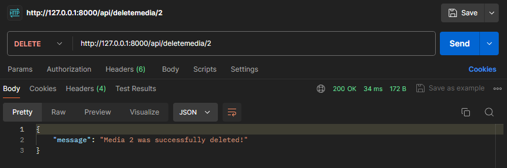

#### GET /allmedia

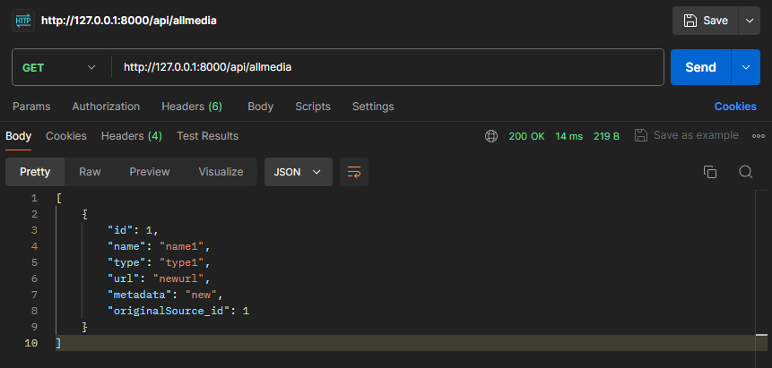
